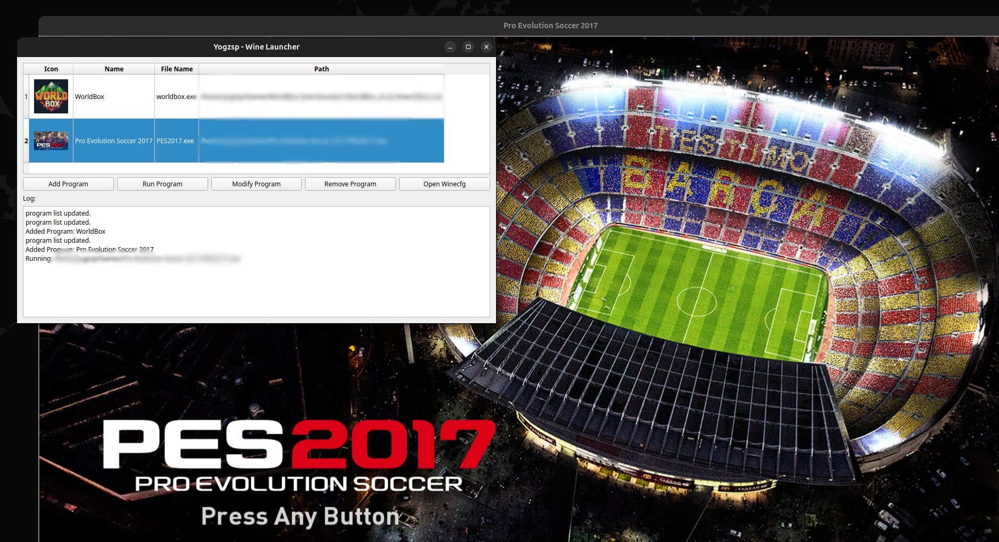

# Yogzsp - Wine Launcher


Yogzsp - Wine Launcher is a PyQt6-based application that allows users to run Windows (`.exe`) programs on Linux using Wine with an easy-to-use graphical interface.

## 📌 Features
- Add Windows programs to a list to be run through Wine.
- Run Windows programs directly from the GUI.
- Edit execution paths and program icons.
- Remove programs from the list.
- Open Wine settings (`winecfg`) directly from the application.

## 📋 Requirements
This application requires the following dependencies to function properly:
- Python 3
- PyQt6
- Wine
- pkexec (to run the application with root privileges)

## 🛠️ Installation
### 1. Clone the Repository
```bash
git clone https://github.com/yogzsp/yogzsp-wine-launcher.git
cd yogzsp-wine-launcher
```

### 2. Run the Installer
```bash
chmod +x installer.sh
sudo ./installer.sh
```

The installer will automatically install the required dependencies and copy the necessary files to the appropriate locations.

## 🚀 How to Use
### 1. Launch the Application
After installation, you can run the application using the following command:
```bash
YogzspWineLauncher
```
Or through your Linux application menu.

### 2. Add a Windows Program
1. Click the `Add Program` button.
2. Select the `.exe` file you want to run.
3. Name the program.
4. (Optional) Choose an icon for the program.
5. Click `OK` to save.

### 3. Run a Program
- Select a program from the list.
- Click the `Run Program` button.

### 4. Modify Program Path or Icon
1. Select the program you want to modify.
2. Click the `Modify Program` button.
3. Choose a new `.exe` file (if changing the path).
4. (Optional) Select a new icon.
5. Click `OK` to save the changes.

### 5. Remove a Program
1. Select the program you want to remove.
2. Click the `Remove Program` button.
3. Confirm the removal.

### 6. Open Wine Settings
- Click the `Open Winecfg` button to access Wine configuration settings.

## 📝 Additional Configuration
The program configuration is stored in `program.json`.
You can manually edit this file if needed.

## ⚠️ Notes
- This application must be run with root privileges as it uses `pkexec` to execute Wine with the necessary permissions.
- Ensure Wine is installed and properly configured before running Windows programs.

## 🤝 Contributions
If you would like to contribute, please fork this repository and submit a pull request!

## 📜 License
This application is released under the MIT license.

---
**Made with ❤️ by Yogzsp.**

